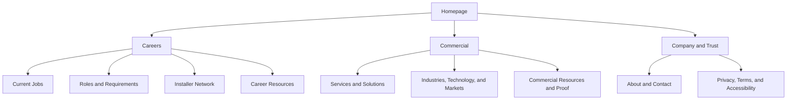

# SB Mobile Installations Site Architecture

**Document:** `07-site-architecture.md`  
**Project:** SB Mobile Installations Website and Installer Recruitment Project  
**Business:** SB Mobile Installations, LLC  
**Primary website outcome:** Attract and convert qualified installer candidates  
**Secondary website outcome:** Establish commercial credibility and generate qualified customer inquiries  
**Status:** Strategic architecture draft  
**Version:** 0.1  
**Last updated:** September 9, 2026

---

## 1. Purpose

This document defines the structural organization of the SB Mobile Installations website.

It governs:

- page hierarchy;
- navigation;
- page families;
- candidate and customer journeys;
- launch scope;
- future expansion;
- reusable templates;
- data relationships;
- internal linking;
- breadcrumbs;
- sitemap inclusion;
- publication and indexation states;
- content ownership;
- conversion routing; and
- safeguards against thin, duplicate, expired, or unsupported pages.

Detailed slug, canonical, redirect, and parameter rules belong in `08-url-strategy.md`.

---

## 2. Architecture Principles

### 2.1 Recruitment comes first

Careers must be a top-level navigation destination. Current openings, installer requirements, assignment information, applications, and the installer network must be easy to reach from any page.

### 2.2 Candidate and commercial journeys remain separate

Recruitment and commercial users may share company information, but they must have distinct:

- navigation pathways;
- calls to action;
- forms;
- confirmation pages;
- CRM pipelines;
- follow-up messages;
- analytics events; and
- success definitions.

### 2.3 One intent, one primary page

Each indexable page should own a clear audience need and search intent. Page creation is not justified when an existing page can satisfy the need without becoming confusing or overly broad.

### 2.4 Architecture follows business truth

The site may be designed to support future services, markets, roles, and technologies, but a route must not be publicly represented as current until the underlying facts are verified.

### 2.5 Development, publication, and indexation are separate

A page can be:

- planned but not built;
- built but not public;
- public but not indexed;
- indexed and active;
- paused;
- archived;
- redirected;
- removed; or
- retired.

The project must not assume that a developed route should automatically be published or indexed.

### 2.6 Depth should stay shallow

High-priority pages should generally be reachable within two or three meaningful clicks from the homepage. Deep URL structure is acceptable only when it communicates a real parent-child relationship.

---

## 3. Primary Website Sections

The site will contain six primary systems:

1. **Homepage:** routes candidates and commercial prospects while establishing the company.
2. **Careers:** primary recruitment hub and conversion system.
3. **Services and solutions:** verified commercial capabilities and project needs.
4. **Industries, technologies, and service areas:** conditional expansion based on verified relevance.
5. **Resources and proof:** authority, education, FAQs, and evidence.
6. **Company, contact, and legal:** entity trust, communication, privacy, accessibility, and terms.

---

## 4. High-Level Site Tree



This tree represents supported architecture, not automatic publication approval for every route.

---

## 5. Launch Priority Definitions

| Priority | Meaning |
|---|---|
| Launch | Required for the first complete public release |
| Launch if verified | Required only when the underlying business fact or opportunity is approved |
| Phase 2 | Valuable after launch foundations and operations are stable |
| Conditional | Build or publish only when demand, evidence, and business capability justify it |
| Utility | Supports a workflow but may not be an organic landing page |
| Future | Architecture reservation; not current scope |

---

## 6. Master Page Registry

| URL | Page name | Audience | Primary intent | Priority | Default indexation |
|---|---|---|---|---|---|
| `/` | Homepage | Candidate and commercial | Brand and pathway selection | Launch | Index |
| `/careers/` | Careers Hub | Candidates | Employer and opportunity overview | Launch | Index |
| `/careers/mobile-installers/` | Mobile Installer Careers | Candidates | Evergreen role exploration | Launch | Index |
| `/careers/jobs/` | Current Openings | Candidates | Active job discovery | Launch | Index |
| `/careers/jobs/[job-slug]/` | Active Job Detail | Candidates | Specific active opening | Launch if verified | Index only while eligible |
| `/careers/installer-requirements/` | Installer Requirements | Candidates | Qualification and self-screening | Launch | Index |
| `/careers/how-assignments-work/` | How Assignments Work | Candidates | Process and expectations | Launch | Index |
| `/careers/apply/` | Installer Application | Candidates | Application completion | Launch | Conditional or noindex |
| `/careers/application-received/` | Application Received | Candidates | Confirmation and next steps | Utility | Noindex |
| `/careers/faqs/` | Candidate FAQs | Candidates | Objection resolution | Launch | Index |
| `/careers/join-our-installer-network/` | Installer Network | Candidates | Future-opportunity registration | Launch | Index if substantial |
| `/careers/installer-training/` | Installer Training | Candidates | Verified development path | Conditional | Index only when program exists |
| `/careers/resources/` | Installer Resources | Candidates | Recruitment education | Phase 2 | Index |
| `/careers/resources/[article-slug]/` | Recruitment Resource | Candidates | Specific role or career question | Phase 2 | Index if useful |
| `/services/` | Services Hub | Commercial | Capability overview | Launch | Index |
| `/services/[service-slug]/` | Service Detail | Commercial | Specific installation service | Launch if verified | Index |
| `/solutions/` | Solutions Hub | Commercial | Project-needs overview | Phase 2 | Index when populated |
| `/solutions/[solution-slug]/` | Solution Detail | Commercial | Project or problem intent | Conditional | Index |
| `/industries/` | Industries Hub | Commercial | Audience overview | Phase 2 | Index when populated |
| `/industries/[industry-slug]/` | Industry Detail | Commercial | Industry-specific needs | Conditional | Index |
| `/technology/` | Technology Hub | Mixed | Approved equipment experience | Phase 2 | Index when populated |
| `/technology/[technology-slug]/` | Technology Detail | Mixed | Platform or equipment intent | Conditional | Index |
| `/service-areas/` | Service Areas Hub | Commercial | Coverage overview | Launch if verified | Index |
| `/service-areas/[state-or-region-slug]/` | State or Region | Commercial | Regional capability | Conditional | Index |
| `/service-areas/[state-slug]/[city-slug]/` | City or Metro | Commercial | Local service intent | Conditional | Index |
| `/resources/` | Commercial Resources | Commercial | Education and authority | Phase 2 | Index |
| `/resources/[article-slug]/` | Commercial Resource | Commercial | Specific informational intent | Phase 2 | Index |
| `/case-studies/` | Case Studies Hub | Commercial and candidates | Proof discovery | Phase 2 | Index when proof exists |
| `/case-studies/[case-study-slug]/` | Case Study | Commercial and candidates | Evidence and validation | Conditional | Index |
| `/faqs/` | Commercial FAQs | Commercial | Buyer questions | Launch | Index |
| `/about/` | About | All | Entity, history, and trust | Launch | Index |
| `/contact/` | Contact | All | General communication | Launch | Index |
| `/request-a-quote/` | Request a Quote | Commercial | Qualified project inquiry | Launch | Index or noindex based on content |
| `/thank-you/` | Commercial Confirmation | Commercial | Inquiry confirmation | Utility | Noindex |
| `/privacy-policy/` | Privacy Policy | All | Data-use disclosure | Launch | Index |
| `/terms/` | Terms | All | Website terms | Launch | Index |
| `/accessibility/` | Accessibility | All | Accessibility commitment and help | Launch | Index |

---

## 7. Homepage Architecture

### Primary role

The homepage establishes the business and routes visitors into the correct audience journey.

### Recommended section order

1. **Hero:** clear company context with two distinct paths
2. **Primary recruitment opportunity:** current openings and installer-network choice
3. **Company credibility:** what the company does and whom it supports
4. **Installer role overview:** GPS, ELD, telematics, fleet technology, and relevant skills
5. **How opportunities work:** concise recruitment steps
6. **Current openings:** verified active jobs only
7. **Installer requirements:** qualification preview
8. **Commercial services:** verified capability overview
9. **Why work with or for SB Mobile:** audience-appropriate proof
10. **Coverage explanation:** verified markets and mobile-service model
11. **FAQs:** selected candidate and commercial questions with clear labels
12. **Final pathways:** apply, join network, or request commercial information

### Primary homepage CTA

View Current Openings.

### Secondary recruitment CTA

Join the Installer Network.

### Commercial CTA

Explore Installation Services or Discuss a Project.

### Homepage rules

- Do not allow the commercial CTA to compete visually with the primary recruiting CTA.
- Do not list an opening unless it is active and approved.
- Do not publish unverified service, scale, or coverage claims.
- Do not place candidate and commercial forms in the same section.

---

## 8. Careers Hub Architecture

### URL

`/careers/`

### Primary purpose

Provide the authoritative overview of installer opportunities and route candidates to the correct next step.

### Recommended sections

1. Careers hero and installer opportunity statement
2. Current openings callout
3. Active jobs versus installer-network explanation
4. Mobile installer role overview
5. Types of relevant installation work
6. Employer or opportunity value proposition
7. Required and preferred qualifications summary
8. Regional, traveling, or role-type distinctions when verified
9. How the recruiting and assignment process works
10. Training or development information when verified
11. Installer stories or proof
12. Candidate FAQs
13. Final current-opening and network pathways

### Primary CTA

View Current Openings.

### Secondary CTA

Join the Installer Network.

### Required internal links

- Mobile installer careers
- Current openings
- Installer requirements
- How assignments work
- Candidate FAQs
- Installer network
- About
- Privacy policy

---

## 9. Mobile Installer Role Page

### URL

`/careers/mobile-installers/`

### Purpose

Own evergreen role intent and help candidates determine whether mobile fleet-technology installation fits their experience and goals.

### Recommended sections

1. Role definition
2. Equipment and installation categories
3. Typical responsibilities
4. Required and preferred experience
5. 12-volt and automotive-electrical skill transfer
6. Vehicle, field, travel, and work environment
7. Tools and technology
8. Testing and documentation expectations
9. Regional and traveling role distinctions
10. Training information when verified
11. Current related openings
12. Candidate FAQs
13. Installer-network alternative

### Primary CTA

View Mobile Installer Openings.

### Boundary

This page must not imitate a current job listing or use `JobPosting` schema.

---

## 10. Current Openings Architecture

### URL

`/careers/jobs/`

### Purpose

Display only verified, active opportunities.

### Recommended components

- Introductory statement
- Active-opening count
- Role cards
- Location or territory
- Engagement type
- Travel indicator
- Posted or reviewed date
- Department or role family
- Filter controls when inventory justifies them
- Clear empty state
- Installer-network alternative
- Candidate FAQ links

### Empty state

When no job is active:

- state that no matching opening is currently listed;
- invite qualified candidates to join the installer network;
- avoid implying immediate work;
- retain useful role and requirements links; and
- remove job markup from the index and any closed pages.

### Filter rules

Do not add filters until the opening inventory justifies them. Filtered or search-result URLs should be noindex by default and should not create crawlable duplicates.

---

## 11. Active Job Detail Template

### URL

`/careers/jobs/[job-slug]/`

### Required visible content

1. Approved job title
2. Active status
3. Hiring or contracting organization
4. Location or territory
5. Field, on-site, travel, or other accurate work arrangement
6. Employee, contractor, subcontractor, project, or other approved classification
7. Full-time, part-time, temporary, or other approved engagement type
8. Compensation where approved or legally required
9. Role summary
10. Responsibilities
11. Required qualifications
12. Preferred qualifications
13. Tools, vehicle, smartphone, insurance, license, and screening requirements
14. Schedule and travel expectations
15. Expense or lodging terms when applicable
16. Application steps
17. Expected next steps
18. Posting or review date
19. Direct application action
20. Privacy and assistance links

### Supporting content

- Company overview
- Role or service context
- Assignment process
- Candidate FAQs
- Related openings
- Installer-network alternative

### Required controls

- Approved job record
- Unique job ID
- Named owner
- Publication date
- Review or valid-through date
- Approved application destination
- Source tracking
- Correct `JobPosting` structured data
- Closing and expiration procedure

### Page-state behavior

| Job state | Page behavior | Schema behavior |
|---|---|---|
| Draft | Preview only | None |
| Approved, not open | Private or scheduled | None |
| Active | Public and indexable | Valid JobPosting |
| Paused | Stop applications; public treatment based on policy | Remove or expire markup |
| Filled | Close application and apply archive or redirect policy | Remove markup |
| Canceled | Close and remove, redirect, 404, or 410 as approved | Remove markup |
| Expired | Follow closing policy immediately | Expire or remove markup |

---

## 12. Installer Requirements Architecture

### URL

`/careers/installer-requirements/`

### Purpose

Help candidates self-qualify while reducing repetitive recruiter questions.

### Recommended sections

- Baseline role expectations
- Required experience
- Preferred equipment experience
- 12-volt and 24-volt knowledge
- Electrical diagnostics
- Vehicle panel access
- Tools and multimeter requirements
- Vehicle and driver-license requirements
- Smartphone and data-submission requirements
- Travel and schedule expectations
- Documentation and photo requirements
- Insurance, background, or screening requirements
- Certification preferences
- Role-specific variation notice
- Current opening links

### Rule

This page provides shared guidance. Every job page must still list its own exact requirements.

---

## 13. How Assignments Work Architecture

### URL

`/careers/how-assignments-work/`

### Purpose

Set accurate expectations from application through onboarding, opportunity communication, installation, closeout, and future work.

### Recommended sections

1. Apply or register interest
2. Qualification review
3. Recruiter contact
4. Technical evaluation
5. Documentation and onboarding
6. Skill, market, and availability profile
7. Opportunity or assignment communication
8. Acceptance and preparation
9. Travel and arrival
10. Installation and testing
11. Documentation and closeout
12. Payment or employee process
13. Feedback and future opportunities

### Required caveats

- Process may vary by role.
- Joining the network does not guarantee work.
- No assignment, schedule, volume, compensation, travel, or expense term may be implied without approval.

---

## 14. Installer Application Architecture

### URL options

- Embedded or modal application on the active job page
- Shared `/careers/apply/` form with required job ID
- Approved external applicant-tracking form

### Preferred approach

Maintain the job description and conversion context on the canonical website page. Use the least disruptive application flow that meets security, privacy, file storage, workflow, and operational needs.

### First-step form groups

1. Job context
2. Contact information
3. Home market
4. Relevant experience
5. Equipment or skill categories
6. Travel availability
7. Resume or experience summary
8. Referral source
9. Required consent and acknowledgments

### Application rules

- Mobile-first
- Accessible
- Short first step
- Job ID preserved
- Source attribution preserved
- No unnecessary sensitive data
- Clear validation
- Visible privacy link
- Confirmation on successful submission
- Error recovery without data loss where practical
- Separate recruitment pipeline

### Indexation

The application page may be noindex when it has little standalone search value or duplicates active-job intent.

---

## 15. Application Confirmation Architecture

### URL

`/careers/application-received/`

### Purpose

Confirm receipt and establish realistic next steps.

### Recommended content

- Submission confirmation
- Role or job reference
- Expected review process
- Approved response-time expectation
- Contact method expectations
- Warning against duplicate applications when appropriate
- Information-update method
- Fraud and payment warning when appropriate
- Link to company and careers information

### Analytics

The pageview alone should not be the only completion signal. Record a successful server or form-platform submission event.

### Indexation

Noindex.

---

## 16. Candidate FAQ Architecture

### URL

`/careers/faqs/`

### Topic groups

- Role and experience
- Employee or contractor classification
- Tools and vehicle
- Travel and schedule
- Compensation and expenses
- Training and certification
- Application and screening
- Assignments and availability
- Installer network
- Privacy and communications

### Rules

- Answers must be factual and current.
- Role-specific differences should link to the active job.
- The FAQ must not replace legal disclosures.
- FAQ markup, if used, must match visible content.
- The page should not promise outcomes.

---

## 17. Installer Network Architecture

### URL

`/careers/join-our-installer-network/`

### Purpose

Collect permission-based interest from qualified installers for potential future opportunities.

### Recommended sections

1. Network purpose
2. Who should join
3. Relevant experience categories
4. Market and travel profile
5. How information may be used
6. What may happen after registration
7. No-job and no-work-guarantee disclosure
8. Privacy and communication preferences
9. Registration form
10. Current openings alternative

### Data groups

- Contact information
- Home market and service radius
- Installation experience
- Equipment or platform familiarity
- Vehicle and tool readiness where appropriate
- Travel availability
- Current availability
- Resume or experience summary
- Communication preference
- Consent

### Structured-data rule

Do not use `JobPosting` structured data.

### Conversion destination

A separate network-confirmation state or page may be used. It should not imply an application or offer.

---

## 18. Installer Training Architecture

### URL

`/careers/installer-training/`

### Status

Conditional.

### Publication prerequisites

- Verified program existence
- Eligible audience
- Prerequisites
- Curriculum
- Duration
- Delivery location or method
- Supervision
- Compensation status
- Completion criteria
- Certification meaning
- Available next steps

### Alternative

If no company program exists, publish honest educational resources about qualifications and preparation without presenting them as SB Mobile training.

---

## 19. Recruitment Resources Architecture

### Hub URL

`/careers/resources/`

### Article URL

`/careers/resources/[article-slug]/`

### Initial topic families

- Role definitions
- Qualification and transferable skills
- Tools and vehicle electronics
- Travel and assignment expectations
- Application and interview preparation
- Technical evaluation
- Installation documentation
- Career development

### Resource template

1. Direct answer or summary
2. Who the topic applies to
3. Detailed explanation
4. Requirements or conditions
5. Practical examples
6. Common questions
7. Relevant current openings
8. Installer-network alternative
9. Author, reviewer, and last-reviewed information

### Boundary

Resources must not imply an active job, training program, certification, compensation, or company policy that has not been approved.

---

## 20. Services Hub Architecture

### URL

`/services/`

### Purpose

Explain the verified commercial service portfolio and route buyers to relevant service details.

### Recommended sections

1. Commercial service overview
2. Approved core services
3. Equipment and vehicle context
4. Installation and field-service process
5. Industries or customer types
6. Geographic model
7. Project and quality considerations
8. Proof
9. Commercial FAQs
10. Project inquiry CTA

### Candidate cross-link

A discreet link may direct installers to careers. It must not compete with the commercial CTA.

---

## 21. Service Detail Architecture

### URL

`/services/[service-slug]/`

### Candidate initial services

- GPS tracking device installation
- ELD installation
- Fleet telematics installation
- Fleet dash-camera installation
- Asset tracking installation
- Mobile electronic equipment installation
- Device removal, replacement, or upgrade
- Installation troubleshooting or service

Every service remains conditional until approved in the service registry.

### Service template

1. Clear service definition
2. Customer problem or project need
3. Service scope
4. Supported equipment categories
5. Appropriate vehicles or assets
6. Customer or industry fit
7. Installation process
8. Scheduling and site readiness
9. Testing and documentation
10. Geographic availability
11. Proof
12. FAQs
13. Related services, industries, technologies, and areas
14. Qualified project CTA

### Boundary

Do not imply equipment sales, software subscriptions, authorization, certification, repair, warranty, or universal coverage unless verified.

---

## 22. Solutions Architecture

### Hub URL

`/solutions/`

### Purpose

Organize content around customer problems and project types that may span more than one service.

### Candidate solution pages

- `/solutions/multi-location-fleet-deployments/`
- `/solutions/fleet-technology-upgrades/`
- `/solutions/device-removal-and-replacement/`
- `/solutions/installation-documentation-and-closeout/`
- `/solutions/on-site-mobile-installation/`

### Solution-page prerequisites

- Verified operational capability
- Distinct buyer intent
- More value than a service-page section
- Defined project process
- Appropriate proof
- Clear conversion path

### Solution template

1. Problem definition
2. Who experiences it
3. Operational impact
4. Appropriate solution scope
5. Services involved
6. Planning and delivery process
7. Limitations and prerequisites
8. Proof
9. FAQs
10. Project CTA

---

## 23. Industry Architecture

### Hub URL

`/industries/`

### Candidate industry pages

- Transportation and logistics
- Construction
- Field service
- Utilities
- Delivery and distribution
- Municipal and public sector
- Rental and equipment fleets

### Status

Conditional. Existing content provides limited support for commercial fleets and construction. Other industries require confirmation.

### Industry template

1. Industry context
2. Fleet, asset, and operating environment
3. Technology and installation needs
4. Scheduling and downtime concerns
5. Applicable verified services
6. Project process
7. Industry-specific requirements
8. Proof
9. FAQs
10. Project CTA

### Boundary

Industry pages may not be created by changing only the industry name. They require distinct operating context and evidence.

---

## 24. Technology Architecture

### Hub URL

`/technology/`

### Detail URL

`/technology/[technology-slug]/`

### Purpose

Explain verified experience with equipment categories or named technology platforms.

### Technology-page prerequisites

- Confirmed company experience
- Current customer or candidate demand
- Approved public wording
- Trademark-aware presentation
- No unsupported authorization or partnership implication
- Distinct content and conversion value

### Technology template

1. Technology or equipment overview
2. Relevant installation use cases
3. Approved hardware scope
4. Vehicle and site considerations
5. Installation, testing, and documentation
6. Related services
7. Relevant installer experience or openings
8. FAQs
9. Commercial CTA

### Candidate relevance

Technology pages may link to jobs requiring that experience, but they must not imply an opening exists.

---

## 25. Service Area Architecture

### Hub URL

`/service-areas/`

### Regional URL

`/service-areas/[state-or-region-slug]/`

### City or metro URL

`/service-areas/[state-slug]/[city-slug]/`

### Purpose

Explain verified geographic service capacity without misrepresenting technician bases as offices.

### Page prerequisites

- Verified active capacity
- Approved services in the market
- Distinct local or regional content
- Scheduling or project limitations
- Accurate office-versus-service-area language
- Owner and review date
- Commercial conversion path
- Local proof where available

### Service-area template

1. Coverage statement
2. Services available
3. Customers and vehicle types supported
4. Mobile-service process
5. Scheduling and project considerations
6. Related nearby coverage
7. Local or regional proof
8. Current local recruiting need when appropriate
9. FAQs
10. Project CTA

### Boundary

Do not generate location pages automatically from a city list. Do not use a technician’s residence as a company location.

---

## 26. Commercial Resources Architecture

### Hub URL

`/resources/`

### Article URL

`/resources/[article-slug]/`

### Topic families

- Service definitions
- Equipment and technology education
- Fleet deployment planning
- Site and vehicle readiness
- Installation quality and documentation
- Fleet downtime reduction
- Removal, replacement, and upgrade planning
- Buyer comparisons
- Industry questions

### Resource template

1. Direct answer
2. Business context
3. Detailed explanation
4. Decision criteria
5. Process or checklist
6. Limitations
7. FAQs
8. Related service or solution
9. Appropriate CTA
10. Author, reviewer, and last-reviewed information

---

## 27. Case Study Architecture

### Hub URL

`/case-studies/`

### Detail URL

`/case-studies/[case-study-slug]/`

### Publication prerequisites

- Customer approval
- Accurate customer naming or approved anonymization
- Approved project facts
- Verified dates and markets
- Verified equipment and vehicle scope
- Approved results
- Image permissions
- Confidentiality review

### Case study template

1. Customer or anonymized profile
2. Project challenge
3. Scope and constraints
4. Planning approach
5. Installation execution
6. Testing and documentation
7. Issues and resolution
8. Verified results
9. Customer quotation when approved
10. Related services and CTA

Case studies may support both commercial trust and candidate confidence.

---

## 28. Commercial FAQ Architecture

### URL

`/faqs/`

### Topic groups

- Services
- Equipment and vehicles
- Scheduling and site readiness
- Geographic coverage
- Project size
- Installation, testing, and documentation
- Removal, replacement, troubleshooting, and support
- Pricing and quotes
- Partnerships and providers

### Rule

The commercial FAQ should not duplicate candidate questions. Cross-link to careers when a user is seeking work.

---

## 29. About Page Architecture

### URL

`/about/`

### Recommended sections

1. Canonical company description
2. Verified history
3. Leadership
4. Operating model
5. Commercial purpose
6. Installer and team model
7. Values expressed through evidence
8. Geographic model
9. Proof and milestones
10. Careers and commercial pathways

### Prerequisites

Company name, entity structure, leadership, history, location, and claims require approval.

---

## 30. Contact Architecture

### URL

`/contact/`

### Purpose

Provide accurate general contact information and route users who are unsure which form to use.

### Recommended routes

- Installer opportunity: Careers
- Active job: Current Openings
- Future installer interest: Installer Network
- Commercial project: Request a Quote
- Provider or partner: Commercial contact option
- General question: General contact

### Rule

Do not use one undifferentiated contact form for all audiences.

---

## 31. Request-a-Quote Architecture

### URL

`/request-a-quote/`

### Purpose

Collect enough information to determine commercial project fit without creating unnecessary friction.

### Form groups

- Contact and company
- Service or equipment need
- Vehicle or asset count
- Project locations
- Desired schedule
- Equipment provider or platform when relevant
- Project description
- Preferred contact method
- Required consent

### Confirmation

Route successful submissions to `/thank-you/` or a verified confirmation state.

### Boundary

Do not send candidate applications through the quote pipeline.

---

## 32. Legal and Trust Architecture

### Required pages

- `/privacy-policy/`
- `/terms/`
- `/accessibility/`

### Privacy policy must address, as applicable

- General website data
- Commercial inquiries
- Candidate applications
- Resume and attachment handling
- Installer-network registration
- Analytics and advertising
- Email and text communication
- Service providers and integrations
- Data retention
- User choices and contact

### Additional conditional pages

- Candidate privacy notice
- Cookie preferences
- Equal-opportunity statement
- Accommodation request information
- Contractor disclosure
- SMS terms

Legal review may be required. Project documentation does not constitute legal advice.

---

## 33. Primary Navigation

### Recommended desktop navigation

1. Careers
2. Current Openings
3. Services
4. How We Work
5. About
6. Resources
7. Contact

### Primary header action

View Current Openings.

### Secondary header action

Commercial users may receive a less visually dominant “Discuss a Project” action.

### Navigation behavior

- Careers remains top-level.
- Current Openings receives direct access.
- Services may open a concise verified-services menu.
- “How We Work” may route candidates and buyers to separate process pages.
- Avoid mega-menu complexity at launch.
- Mobile navigation must preserve the same priorities.

---

## 34. Careers Subnavigation

Recommended careers navigation:

- Careers Overview
- Current Openings
- Mobile Installers
- Requirements
- How Assignments Work
- Candidate FAQs
- Join Installer Network

Add Training and Resources only when those sections contain approved, useful content.

---

## 35. Footer Architecture

### Careers column

- Careers Overview
- Current Openings
- Mobile Installers
- Installer Requirements
- How Assignments Work
- Candidate FAQs
- Join Installer Network

### Services column

- Services Overview
- Approved core services
- Solutions
- Service Areas

### Company column

- About
- Resources
- Case Studies
- Contact
- Request a Quote

### Legal column

- Privacy Policy
- Terms
- Accessibility
- Candidate privacy or SMS terms when required

### Contact block

Use only verified phone, email, address, hours, and social links.

---

## 36. Breadcrumb Architecture

### Examples

- Home > Careers
- Home > Careers > Current Openings
- Home > Careers > Current Openings > Job Title
- Home > Careers > Installer Resources > Article
- Home > Services > Service Name
- Home > Industries > Industry Name
- Home > Service Areas > State > City
- Home > Resources > Article
- Home > Case Studies > Case Study

### Rules

- Breadcrumbs reflect actual hierarchy.
- Labels use human-readable names.
- Current page is visible but not linked to itself.
- Breadcrumb structured data must match visible breadcrumbs.

---

## 37. Internal Linking Model

### Recruitment hub-and-spoke model

The careers hub links to role, jobs, requirements, process, FAQs, and network pages. Each supporting page links back to the careers hub and toward the next logical conversion.

### Commercial hub-and-spoke model

Services, industries, technologies, solutions, service areas, resources, and case studies link through verified relationships rather than linking every page to every other page.

### Cross-system links

- Service pages may link to relevant installer opportunities.
- Job pages may link to the verified service category involved.
- About and case studies may support both audiences.
- Commercial and candidate CTAs remain visually distinct.

### Link-quality rules

- Use descriptive anchors.
- Link only when helpful.
- Avoid sitewide exact-match keyword lists.
- Do not link to unpublished or expired pages.
- Check orphan pages automatically.

---

## 38. Page Family Relationships

| Parent family | Child family | Required relationship |
|---|---|---|
| Careers | Job | Job is active and approved |
| Careers | Role | Role is supported by recruiting strategy |
| Careers | Resource | Resource supports candidate intent |
| Role | Job | Job belongs to role family |
| Job | Market | Location is accurate for the opportunity |
| Job | Technology | Technology is part of approved duties or qualifications |
| Services | Service | Service is verified and marketed |
| Service | Industry | Service is relevant and verified for the industry |
| Service | Technology | Equipment experience is verified |
| Service | Service area | Service is available in the market |
| Solution | Service | Service contributes to the solution |
| Case study | Service | Project used the service |
| Case study | Industry | Project belongs to approved industry context |
| Resource | Service or role | Resource supports the target transactional page |

These relationships should be stored as data where practical, not recreated manually in each page.

---

## 39. Content and Data Collections

Recommended structured collections include:

### Jobs

- Job ID
- Slug
- Title
- Status
- Hiring organization
- Role family
- Location or territory
- Engagement type
- Compensation
- Responsibilities
- Qualifications
- Requirements
- Dates
- Application destination
- Owner
- Distribution sources

### Roles

- Role ID
- Name
- Summary
- Equipment categories
- Skills
- Requirements
- Travel types
- Related jobs
- Related resources

### Services

- Service ID
- Name
- Status
- Summary
- Scope
- Equipment
- Vehicles
- Industries
- Service areas
- Related technologies
- Proof
- FAQs

### Locations

- Location ID
- Type
- Name
- Parent region
- Office status
- Service capacity
- Recruiting status
- Available services
- Contact data
- Review date

### Technologies

- Technology ID
- Name
- Category
- Experience status
- Relationship status
- Approved wording
- Logo permission
- Related jobs and services

### Resources and proof

- Content ID
- Audience
- Intent
- Topic
- Author and reviewer
- Dates
- Related entities
- Publication and indexation status

---

## 40. Content Ownership

| Content family | Primary owner | Required approvers |
|---|---|---|
| Business identity | Business leadership | Authorized company representative |
| Active jobs | Recruiting owner | Business and legal review as required |
| Careers evergreen content | Recruiting and content owners | Business owner |
| Candidate forms and privacy | Recruiting and technical owners | Privacy or legal review as required |
| Services | Commercial owner | Business and operations |
| Technology claims | Operations or technical owner | Business and brand review |
| Service areas | Operations | Business owner |
| Case studies and testimonials | Commercial owner | Customer and business approval |
| Legal pages | Business owner | Qualified legal review as required |
| Technical metadata and schema | SEO and development | Content owner for factual fields |

Every active job, location page, and time-sensitive claim needs a named maintenance owner.

---

## 41. Sitemap Architecture

### XML sitemap inclusion

Include:

- indexable core pages;
- active job pages;
- verified service, solution, industry, technology, and service-area pages;
- indexable resources;
- approved case studies; and
- accurate `lastmod` values.

Exclude:

- confirmation pages;
- private previews;
- drafts;
- internal search and filter URLs;
- duplicate parameter URLs;
- expired or removed jobs;
- noindex utilities; and
- pages blocked from public access.

### HTML sitemap

An HTML sitemap is optional. Create it only if it materially improves discovery for users rather than duplicating primary navigation.

---

## 42. Search and Filter Architecture

### Current openings

Potential filters:

- Role family
- Location or region
- Traveling versus regional
- Engagement type
- Experience level

### Resources

Potential filters:

- Audience
- Topic
- Content type

### Rules

- Do not add filter complexity for a small inventory.
- Use client-side filtering or controlled parameters when appropriate.
- Noindex filter combinations by default.
- Do not allow infinite crawl spaces.
- Maintain accessible controls.
- Preserve useful results without relying on JavaScript alone when server rendering is needed.

---

## 43. Error and Empty-State Architecture

### Required states

- 404 not found
- Closed job
- No current openings
- No matching filtered openings
- Form submission error
- File upload error
- Network interruption
- Expired session when applicable
- Maintenance or temporary unavailability

### Principles

- Explain what happened.
- Preserve user input where practical.
- Offer the correct next step.
- Never imply successful submission when it failed.
- Avoid redirecting every closed job to the homepage.
- Use 404 or 410 when removal is the approved job policy.

---

## 44. Structured Data by Page Family

| Page family | Potential structured data | Conditions |
|---|---|---|
| Homepage | Organization, WebSite | Verified entity information |
| Careers hub | WebPage, BreadcrumbList | No JobPosting for general careers content |
| Job detail | JobPosting, BreadcrumbList | One real active job; visible content matches |
| Role page | WebPage, BreadcrumbList | No JobPosting unless it is a specific opening |
| Service | Service, BreadcrumbList | Verified service and provider data |
| FAQ | FAQPage when eligible | Visible factual answers and current eligibility |
| Article | Article or BlogPosting, BreadcrumbList | Accurate author, publisher, and dates |
| Service area | Service and appropriate organization references | No false physical location |
| Case study | Article or WebPage | Accurate content and proof |
| About | AboutPage, Organization reference | Verified entity facts |
| Contact | ContactPage, Organization reference | Verified contact data |

Detailed rules belong in `13-schema-markup-plan.md` and `30-job-content-schema-specification.md`.

---

## 45. Analytics Architecture

### Recruitment events

- Careers hub viewed
- Job index viewed
- Job detail viewed
- Opening filter used
- Requirements viewed
- Assignment process viewed
- Apply clicked
- Application started
- Application field error
- Resume upload completed or failed
- Application submitted
- Installer-network started
- Installer-network submitted
- Candidate contact action

### Commercial events

- Service viewed
- Technology or industry viewed
- Case study viewed
- Request quote clicked
- Commercial form started
- Commercial form submitted
- Commercial phone or email action

### Required dimensions

- Audience journey
- Page family
- Job or content ID
- Role or service
- Market
- Source, medium, and campaign
- Recruitment platform
- Device type
- Conversion type

CRM outcome data should connect applications to qualification and activation without placing unnecessary sensitive candidate information in analytics.

---

## 46. Performance and Accessibility Architecture

Every page family must support:

- semantic HTML;
- keyboard navigation;
- visible focus states;
- accessible headings;
- descriptive labels;
- useful errors;
- sufficient color contrast;
- responsive layouts;
- reduced-motion preferences;
- optimized images;
- stable layout;
- fast mobile loading; and
- progressive enhancement where appropriate.

The job and application experience receives the highest mobile-performance priority.

---

## 47. Technical Route Model

The planned Next.js App Router structure may follow:

```text
app/
├── page.tsx
├── careers/
│   ├── page.tsx
│   ├── mobile-installers/page.tsx
│   ├── jobs/
│   │   ├── page.tsx
│   │   └── [slug]/page.tsx
│   ├── installer-requirements/page.tsx
│   ├── how-assignments-work/page.tsx
│   ├── apply/page.tsx
│   ├── application-received/page.tsx
│   ├── faqs/page.tsx
│   ├── join-our-installer-network/page.tsx
│   ├── installer-training/page.tsx
│   └── resources/
│       ├── page.tsx
│       └── [slug]/page.tsx
├── services/
│   ├── page.tsx
│   └── [slug]/page.tsx
├── solutions/
├── industries/
├── technology/
├── service-areas/
├── resources/
├── case-studies/
├── faqs/page.tsx
├── about/page.tsx
├── contact/page.tsx
├── request-a-quote/page.tsx
├── thank-you/page.tsx
├── privacy-policy/page.tsx
├── terms/page.tsx
└── accessibility/page.tsx
```

The implementation may use route groups, content collections, or other maintainable patterns as long as public URLs and governance rules remain consistent.

---

## 48. Reusable Template Inventory

### Recruitment templates

- Careers hub
- Role overview
- Jobs index
- Job detail
- Installer requirements
- Assignment process
- Candidate FAQ
- Installer network
- Recruitment resource
- Application and confirmation

### Commercial templates

- Services hub
- Service detail
- Solutions hub and detail
- Industries hub and detail
- Technology hub and detail
- Service-area hub and detail
- Resource hub and article
- Case-study hub and detail
- Commercial FAQ
- Quote and confirmation

### Shared templates

- Homepage
- About
- Contact
- Legal policy
- Error and empty state

Reusable templates must allow page-specific content and evidence. They should not produce near-duplicate pages.

---

## 49. Launch Scope Recommendation

### Required recruitment pages

- Homepage
- Careers hub
- Mobile installer role
- Current openings index
- At least one verified active job detail when an opening exists
- Installer requirements
- How assignments work
- Application flow
- Application confirmation
- Candidate FAQs
- Installer network

### Required commercial and trust pages

- Services hub
- Verified core service pages
- Commercial FAQs
- About
- Contact
- Request a quote
- Commercial confirmation
- Service areas hub only if meaningful coverage can be verified
- Privacy policy
- Terms
- Accessibility

### Conditional launch content

- Installer training
- Technology pages
- Industry pages
- Solution pages
- Individual service-area pages
- Resources
- Case studies

It is better to launch a smaller accurate architecture than a large unsupported one.

---

## 50. Phase 2 Expansion

After recruiting operations and core pages are stable:

- publish recruitment resources;
- add verified installer stories;
- expand real market-specific job content;
- add training content when approved;
- build verified service clusters;
- publish industry and technology pages with evidence;
- add high-value service areas;
- publish commercial resources;
- develop case studies;
- add advanced job filtering when inventory justifies it; and
- strengthen cross-system internal linking.

---

## 51. Architecture Risks and Controls

| Risk | Architecture control |
|---|---|
| Recruitment hidden behind commercial navigation | Top-level Careers and Current Openings |
| Candidate and buyer confusion | Distinct journeys, CTAs, forms, and confirmations |
| Fake evergreen jobs | Separate active jobs from installer network |
| Expired jobs remain indexed | Job status, review date, closing workflow, schema removal |
| Thin location pages | Verification and distinct-content prerequisites |
| False office signals | Explicit office, technician base, and service-area distinctions |
| Duplicate intent | Canonical page ownership and cannibalization review |
| Platform-name overreach | Technology approval and relationship status |
| Unmanageable page count | Conditional matrices and phased publication |
| Orphan pages | Parent-child data and automated link checks |
| Sensitive data exposure | Approved form, storage, and access architecture |
| Search crawl waste | Controlled filters, sitemaps, canonicals, and noindex rules |

---

## 52. Architecture Approval Checklist

Before approving a page family, confirm:

- Audience is defined.
- Search intent is distinct.
- Business purpose is clear.
- Primary CTA exists.
- Content owner exists.
- Required facts are verified.
- Template supports useful unique content.
- Data source is defined.
- Internal links are mapped.
- Structured-data eligibility is understood.
- Publication and indexation rules are defined.
- Analytics events are specified.
- Accessibility and mobile behavior are covered.
- Maintenance and retirement procedures exist.

---

## 53. Open Decisions

- Which active installer roles will exist at launch?
- Will applications be embedded, first-party, or ATS-hosted?
- Which pages will be public but noindex?
- What is the approved closed-job URL policy?
- Which recruiting filters are justified at launch?
- Is a separate candidate privacy notice required?
- Does the company have a verified training program?
- Which commercial services are approved?
- Which industries and technologies have enough evidence for launch?
- Which markets have verified service capacity?
- Which business profile locations are eligible?
- Which proof assets are available?
- What content-management model will maintain jobs and resources?
- Who owns each time-sensitive page family?

---

## 54. Related Documents

- `00-project-overview.md`
- `01-business-source-of-truth.md`
- `02-business-overview.md`
- `03-audience-personas.md`
- `04-competitor-research.md`
- `05-keyword-research.md`
- `06-search-intent-map.md`
- `08-url-strategy.md`
- `09-content-strategy.md`
- `10-on-page-seo-standards.md`
- `11-local-seo-plan.md`
- `12-aeo-geo-llm-optimization.md`
- `13-schema-markup-plan.md`
- `14-conversion-strategy.md`
- `15-analytics-and-measurement.md`
- `16-technical-architecture.md`
- `20-component-inventory.md`
- `28-recruitment-strategy.md`
- `30-job-content-schema-specification.md`

---

## 55. Maintenance

Review this architecture when:

- a role, service, market, technology, or industry changes;
- the application or CRM system changes;
- navigation changes;
- a new page family is proposed;
- Search Console or Bing data indicates duplication or orphaning;
- job inventory requires new filters;
- legal or privacy requirements change;
- the business model changes; or
- quarterly architecture audits identify stale or unsupported content.

Architecture changes must be reflected in the URL strategy, route registry, sitemap, navigation, internal links, schema, analytics, redirects, content briefs, and QA plan.
